# 📋 อธิบาย Code ระบบจัดการร้านยา — เน้นหลักการ DBMS

---

## 1. สถาปัตยกรรมภาพรวม (Architecture)

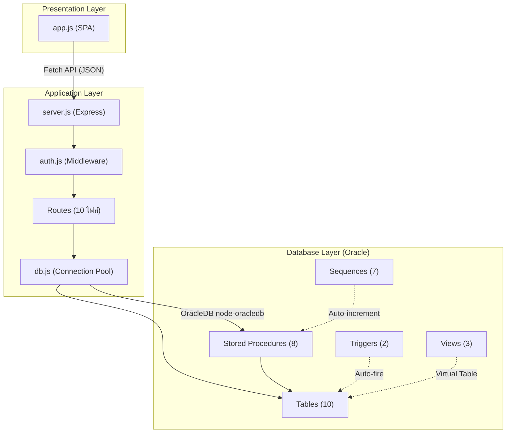

ระบบนี้เป็น **3-Tier Architecture** ที่ย้าย Business Logic ลงฐานข้อมูล (Stored Procedure) ให้มากที่สุด

---

## 2. Database Schema — ER Diagram

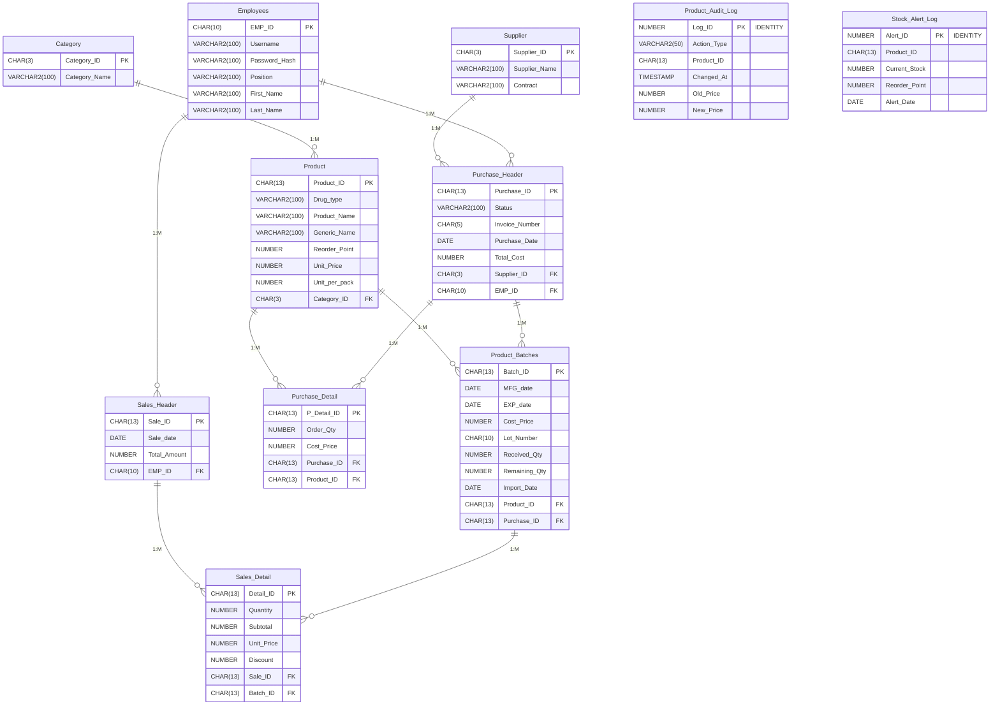

### ความสัมพันธ์ (Relationships) ที่สำคัญ

| ความสัมพันธ์ | ประเภท | ความหมาย |
|-------------|--------|---------|
| Category → Product | **1:M** | หมวดหมู่ 1 หมวดมีหลายสินค้า |
| Product → Product_Batches | **1:M** | สินค้า 1 ตัวมีหลายล็อต (ต่างวันผลิต/หมดอายุ) |
| Purchase_Header → Purchase_Detail | **1:M** | ใบสั่งซื้อ 1 ใบมีหลายรายการ (Master-Detail Pattern) |
| Sales_Header → Sales_Detail | **1:M** | บิลขาย 1 ใบมีหลายรายการ |
| **Product_Batches → Sales_Detail** | **1:M** | **สำคัญ!** ขายจากล็อต ไม่ใช่จากสินค้า (FEFO tracking) |
| Purchase_Header → Product_Batches | **1:M** | เมื่อรับสินค้า → สร้าง Batch จากใบสั่งซื้อ |

> [!IMPORTANT]
> **ทำไม `Sales_Detail` อ้างถึง `Product_Batches` แทน `Product`?**
> เพราะระบบนี้ต้องตัดสต็อก **ระดับ Lot/Batch** (FEFO = First Expired, First Out) ไม่ใช่แค่ลดจำนวนรวมๆ จึงต้องรู้ว่าขายจาก Batch ไหน เพื่อจะได้ลด `Remaining_Qty` ของ Batch นั้นๆ ได้

### Referential Integrity (FK Constraints)

ทุกตาราง enforce FK ด้วย `FOREIGN KEY ... REFERENCES` เช่น:
```sql
CONSTRAINT Prod_batch_FK FOREIGN KEY (Product_ID) REFERENCES Product (Product_ID)
```
→ ถ้าจะ INSERT Batch ที่ Product_ID ไม่มีจริงในตาราง Product → Oracle จะ Reject ทันที (`ORA-02291`)

---

## 3. Sequences — การสร้าง Primary Key อัตโนมัติ

[sequences.sql](file:///d:/dash/DBMSFinal/Table/Procedures/sequences.sql)

```sql
CREATE SEQUENCE seq_sale        START WITH 100 INCREMENT BY 1 NOCACHE;
CREATE SEQUENCE seq_sale_detail START WITH 100 INCREMENT BY 1 NOCACHE;
CREATE SEQUENCE seq_purchase    START WITH 100 INCREMENT BY 1 NOCACHE;
-- ... รวม 7 Sequences
```

| Sequence | ใช้ใน Procedure | รูปแบบ ID ที่ได้ |
|----------|----------------|-----------------|
| `seq_sale` | `sp_create_sale` | `SAL0000000100` |
| `seq_sale_detail` | `sp_add_sale_item` | `SDT0000000100` |

### หลักการทำงาน Sequence

- **`NEXTVAL`** — ทุกครั้งที่เรียก จะ +1 อัตโนมัติ ไม่มีวันซ้ำ (Atomic)
- **`NOCACHE`** — ไม่แคชค่าในหน่วยความจำ ป้องกันค่าข้ามเมื่อ DB Crash
- **+`LPAD`** — เติม 0 ข้างหน้าให้ครบ เช่น `LPAD(100, 10, '0')` → `0000000100`
- **thread-safe** — 10 คนกดพร้อมกัน ทุกคนได้ ID ไม่ซ้ำ (Oracle จัดการให้)

> [!NOTE]
> บาง Stored Procedure ใช้ **Timestamp-based ID** แทน Sequence เช่น `sp_create_purchase` ใช้ `'P' || TO_CHAR(SYSDATE, 'YYMMDDHH24MISS')` — ข้อเสีย: ถ้า 2 คนกดในวินาทีเดียวกันจะซ้ำ (ซึ่ง `DUP_VAL_ON_INDEX` exception จะจับได้)

---

## 4. Stored Procedures — Business Logic ใน Database

### 4.1 `sp_create_sale` — สร้างบิลขาย

[sp_create_sale.sql](file:///d:/dash/DBMSFinal/Table/Procedures/sp_create_sale.sql)

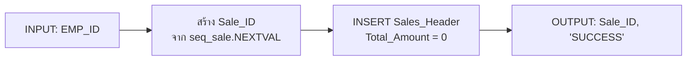

**หลักการ:**
- ตั้ง `Total_Amount = 0` ไว้ก่อน → ค่อยๆ บวกทีหลังใน `sp_add_sale_item`
- เรียกว่า **"Header First" Pattern** — สร้างตารางแม่ก่อน แล้วค่อยเพิ่มตารางลูก

---

### 4.2 `sp_add_sale_item` — ขายยา + ตัดสต็อก (สำคัญมาก!)

[sp_add_sale_item.sql](file:///d:/dash/DBMSFinal/Table/Procedures/sp_add_sale_item.sql)

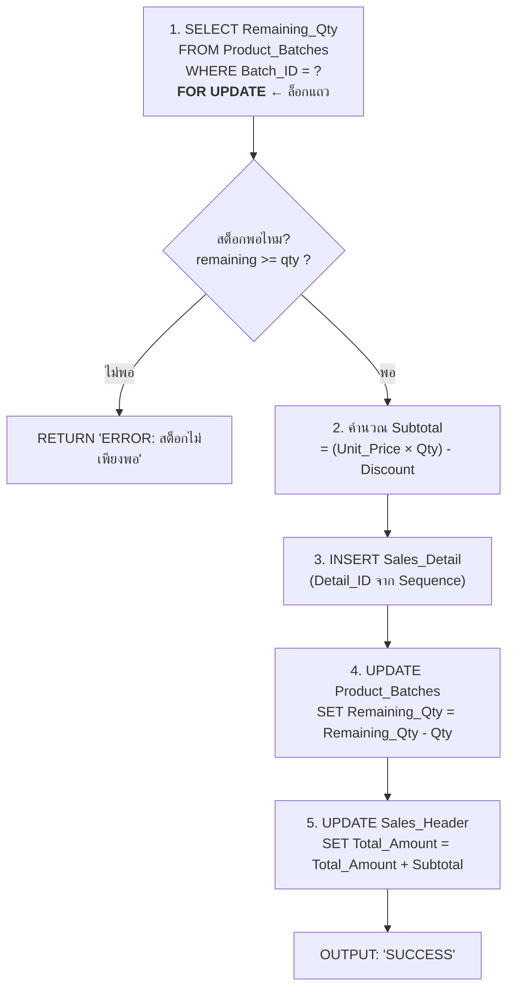

> [!CAUTION]
> **Concurrency Control ด้วย `SELECT ... FOR UPDATE` (Pessimistic Locking)**
>
> **ปัญหา (Race Condition)**:  ถ้าไม่ล็อก → 2 Transaction พร้อมกัน อาจอ่านสต็อกเหลือ 5, ทั้งคู่คิดว่าพอ, ทำให้ขายเกินจริง (สต็อกติดลบ)
>
> **วิธีแก้**: `FOR UPDATE` จะล็อกแถวนั้นทันที → Transaction ตัวที่ 2 จะ **ต้องรอ** จนตัวที่ 1 COMMIT/ROLLBACK เสร็จก่อน → กัน Lost Update

**DBMS Concepts ที่ใช้:**
1. **Row-level Locking** (`FOR UPDATE`)
2. **Atomicity** — INSERT + UPDATE + UPDATE ทำ 3 อย่างรวมกันเป็น 1 Transaction
3. **NVL Function** — กัน NULL (`NVL(p_discount, 0)`)
4. **Exception Handling** — `WHEN NO_DATA_FOUND` / `WHEN OTHERS`

---

### 4.3 `sp_create_purchase` — สร้างใบสั่งซื้อ

[sp_create_purchase.sql](file:///d:/dash/DBMSFinal/Table/Procedures/sp_create_purchase.sql)

```sql
p_purchase_id := 'P' || TO_CHAR(SYSDATE, 'YYMMDDHH24MISS');
INSERT INTO Purchase_Header (...) VALUES (p_purchase_id, 'รอรับสินค้า', ...);
```

**DBMS Concepts**: OUT Parameter, DUP_VAL_ON_INDEX Exception, DATE Function

---

### 4.4 `sp_add_purchase_item` — เพิ่มรายการในใบสั่งซื้อ

[sp_add_purchase_item.sql](file:///d:/dash/DBMSFinal/Table/Procedures/sp_add_purchase_item.sql)

```sql
p_detail_id := 'D' || TO_CHAR(SYSTIMESTAMP, 'HH24MISSFF6');
p_detail_id := SUBSTR(p_detail_id, 1, 13);  -- ตัดให้เหลือ 13 ตัว (ตาม CHAR(13))
```

**DBMS Concepts**: `SYSTIMESTAMP` (มี fractional seconds), `SUBSTR` (ตัดสตริง)

---

### 4.5 `sp_receive_purchase` — รับสินค้าเข้าคลัง (ซับซ้อนที่สุด!)

[sp_receive_purchase.sql](file:///d:/dash/DBMSFinal/Table/Procedures/sp_receive_purchase.sql)

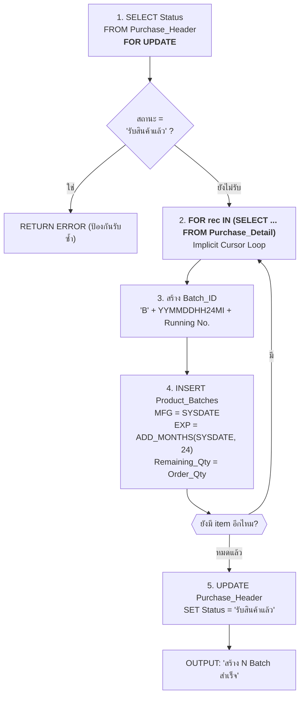

**DBMS Concepts ที่ใช้:**

| Concept | อธิบาย |
|---------|--------|
| **Pessimistic Locking** (`FOR UPDATE`) | ล็อก Header ก่อน ป้องกัน Manager 2 คนกดรับพร้อมกัน |
| **Implicit Cursor FOR LOOP** | `FOR rec IN (SELECT ...) LOOP` — Oracle เปิด Cursor อัตโนมัติ วนทุกแถว แล้วปิดเอง |
| **ADD_MONTHS()** | ฟังก์ชัน Oracle сำหรับบวกเดือน (24 เดือน = 2 ปี) |
| **SYSDATE** | วันเวลาปัจจุบันของ DB Server (ไม่ใช่ Client) |
| **State Machine Pattern** | สถานะ: `รอรับสินค้า → รับสินค้าแล้ว` (ไม่สามารถย้อนกลับ) |

---

### 4.6 `sp_upsert_product` — เพิ่ม/แก้ไขสินค้า (UPSERT Pattern)

[sp_upsert_product.sql](file:///d:/dash/DBMSFinal/Table/Procedures/sp_upsert_product.sql)

```sql
IF UPPER(p_action) = 'INSERT' THEN
    INSERT INTO Product (...) VALUES (...);
ELSIF UPPER(p_action) = 'UPDATE' THEN
    UPDATE Product SET ... WHERE TRIM(Product_ID) = TRIM(p_product_id);
END IF;
```

**DBMS Concepts**: **UPSERT** — รวม INSERT/UPDATE ไว้ใน Procedure เดียว ลดจำนวน Procedure; **TRIM()** — ลบช่องว่างจาก CHAR type

---

### 4.7 `sp_delete_product` / `sp_delete_employee` — ลบพร้อมเช็ค Referential Integrity

[sp_delete_product.sql](file:///d:/dash/DBMSFinal/Table/Procedures/sp_delete_product.sql)

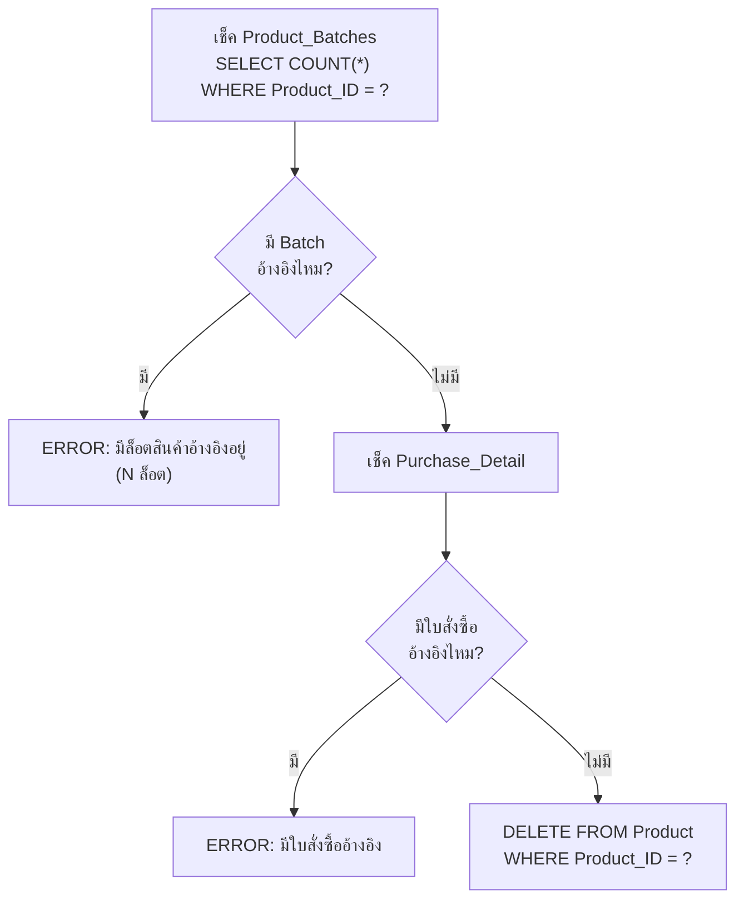

**DBMS Concepts**:
- **Referential Integrity Check** — เช็ค FK dependency ด้วย code ก่อนลบ แทนที่จะปล่อยให้ Oracle โยน `ORA-02292` (ให้ error message เป็นภาษาไทยที่เข้าใจง่ายกว่า)
- ใช้กับทั้ง Product (เช็ค Batch, Purchase_Detail) และ Employee (เช็ค Sales_Header, Purchase_Header)

---

### 4.8 `sp_get_dashboard` — ดึงข้อมูลสรุป (SYS_REFCURSOR)

[sp_get_dashboard.sql](file:///d:/dash/DBMSFinal/Table/Procedures/sp_get_dashboard.sql)

```sql
-- OUT Parameters:
p_today_revenue     OUT NUMBER,          -- ค่า scalar
p_today_count       OUT NUMBER,
p_product_count     OUT NUMBER,
p_low_stock_cur     OUT SYS_REFCURSOR,   -- ← ผลลัพธ์เป็น "ตาราง" 
p_expiring_cur      OUT SYS_REFCURSOR,
p_recent_sales_cur  OUT SYS_REFCURSOR
```

**DBMS Concepts:**

| Concept | อธิบาย |
|---------|--------|
| **SYS_REFCURSOR** | ตัวแปรที่เก็บ "ผลลัพธ์ของ SELECT" ไว้ → Node.js อ่านออกมาเป็น Array ได้ |
| **OPEN cursor FOR SELECT** | เปิด Cursor แล้วผูกกับ Query |
| **Aggregate Functions** | `SUM()`, `COUNT()`, `NVL()`, `MIN()` |
| **GROUP BY + HAVING** | หา Product ที่สต็อกรวม < Reorder_Point |
| **LEFT JOIN** | รวมข้อมูลข้ามตาราง (Product + Batches + Employees) |
| **TRUNC(SYSDATE)** | ตัดเวลาออก เหลือแค่วันที่ (เทียบ = ได้) |
| **ROWNUM** | จำกัดผลลัพธ์ 10 แถว (เหมือน LIMIT ใน MySQL) |

---

## 5. Triggers — Event-Driven Logic

### 5.1 `trg_product_audit` — Audit Trail (บันทึกประวัติเปลี่ยนแปลง)

[trg_product_audit.sql](file:///d:/dash/DBMSFinal/Table/Procedures/trg_product_audit.sql)

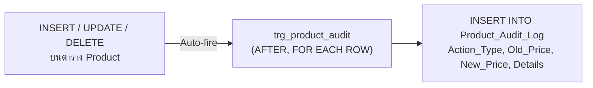

```sql
AFTER INSERT OR UPDATE OR DELETE ON Product
FOR EACH ROW   -- ← ทำงานทุกแถวที่ถูกแก้ไข
BEGIN
    IF INSERTING THEN
        -- :NEW = ค่าใหม่ที่เพิ่งถูก INSERT
        INSERT INTO Product_Audit_Log (Action_Type, New_Price, ...) VALUES ('INSERT', :NEW.Unit_Price, ...);
    ELSIF UPDATING THEN
        -- :OLD = ค่าเก่าก่อน UPDATE, :NEW = ค่าใหม่หลัง UPDATE
        INSERT INTO Product_Audit_Log (Old_Price, New_Price, ...) VALUES (:OLD.Unit_Price, :NEW.Unit_Price, ...);
    ELSIF DELETING THEN
        -- :OLD = ค่าของแถวที่กำลังถูกลบ
        INSERT INTO Product_Audit_Log (Action_Type, Old_Price, ...) VALUES ('DELETE', :OLD.Unit_Price, ...);
    END IF;
END;
```

**DBMS Concepts:**

| Concept | อธิบาย |
|---------|--------|
| **Row-level Trigger** (`FOR EACH ROW`) | ทำงานทุกแถวที่ถูกแก้ |
| **AFTER Trigger** | ทำงานหลังจาก DML สำเร็จแล้ว |
| **`:OLD` / `:NEW` Pseudo-records** | อ้างค่าเก่า/ใหม่ของแถวที่ถูกแก้ |
| **Conditional Predicates** | `INSERTING`, `UPDATING`, `DELETING` — เช็คว่า Trigger ถูกเรียกจาก DML ไหน |
| **Audit Trail Pattern** | บันทึกทุกการเปลี่ยนแปลง ใช้สำหรับตรวจสอบย้อนหลัง |

---

### 5.2 `trg_low_stock_alert` — แจ้งเตือนสต็อกต่ำ (Compound Trigger)

[trg_low_stock_alert.sql](file:///d:/dash/DBMSFinal/Table/Procedures/trg_low_stock_alert.sql)

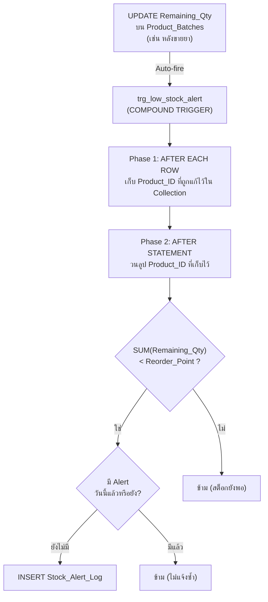

> [!IMPORTANT]
> **ทำไมต้องใช้ Compound Trigger? → แก้ปัญหา Mutating Table (ORA-04091)**
>
> - **Mutating Table** = ตารางที่ Trigger กำลัง modify อยู่ ห้าม SELECT กลับ
> - ถ้าใช้ Row-level Trigger แล้ว SELECT SUM(Remaining_Qty) FROM Product_Batches → **ERROR!** เพราะตาราง Product_Batches กำลังถูก UPDATE อยู่
> - **วิธีแก้**: ใช้ **Compound Trigger** แบ่งเป็น 2 Phase:
>   - **AFTER EACH ROW** → แค่จด Product_ID ไว้ใน Collection (ยังไม่ SELECT)
>   - **AFTER STATEMENT** → Statement จบแล้ว ตารางไม่ Mutate แล้ว → SELECT SUM() ได้ปลอดภัย

**DBMS Concepts:**

| Concept | อธิบาย |
|---------|--------|
| **Compound Trigger** | Trigger ที่มีหลาย Phase (BEFORE/AFTER × ROW/STATEMENT) |
| **Mutating Table Problem** | ข้อจำกัดของ Oracle ที่ห้าม query ตารางที่กำลัง modify |
| **PL/SQL Collection** (`TABLE OF`) | โครงสร้างข้อมูลแบบ Array ใน PL/SQL |
| **TRUNC(SYSDATE)** | ตัดเวลาออก เทียบเฉพาะวันที่ (กัน Alert ซ้ำวันเดียวกัน) |

---

## 6. Views — Virtual Tables (ตารางเสมือน)

[views.sql](file:///d:/dash/DBMSFinal/Table/Procedures/views.sql)

### 6.1 `v_monthly_sales` — สรุปยอดขายรายเดือน

```sql
SELECT TO_CHAR(sh.Sale_date, 'YYYY-MM') AS Sale_Month,
       COUNT(*) AS Sale_Count,
       NVL(SUM(sh.Total_Amount), 0) AS Total_Revenue
FROM Sales_Header sh
GROUP BY TO_CHAR(sh.Sale_date, 'YYYY-MM'), ...
ORDER BY Sale_Month DESC;
```

### 6.2 `v_stock_summary` — สรุปสต็อกทุกสินค้า

```sql
SELECT p.Product_ID, p.Product_Name,
       NVL(SUM(pb.Remaining_Qty), 0) AS Total_Stock,
       CASE 
           WHEN NVL(SUM(pb.Remaining_Qty), 0) = 0         THEN 'หมดสต็อก'
           WHEN NVL(SUM(pb.Remaining_Qty), 0) < p.Reorder_Point THEN 'สต็อกต่ำ'
           ELSE 'ปกติ'
       END AS Stock_Status
FROM Product p
LEFT JOIN Category c ON p.Category_ID = c.Category_ID
LEFT JOIN Product_Batches pb ON p.Product_ID = pb.Product_ID
GROUP BY ...;
```

### 6.3 `v_top_products` — สินค้าขายดี

```sql
SELECT p.Product_Name, SUM(sd.Quantity) AS Total_Sold, SUM(sd.Subtotal) AS Total_Revenue
FROM Sales_Detail sd
JOIN Product_Batches pb ON sd.Batch_ID = pb.Batch_ID   -- ← ผ่าน Batch
JOIN Product p ON pb.Product_ID = p.Product_ID
GROUP BY ... ORDER BY Total_Sold DESC;
```

**DBMS Concepts ที่ใช้ใน Views:**

| Concept | อธิบาย |
|---------|--------|
| **View** | คือ SELECT ที่ถูกเก็บไว้ ใช้ซ้ำได้โดยไม่ต้องเขียน Query ยาวๆ ทุกครั้ง |
| **GROUP BY** | จัดกลุ่มข้อมูลตามคอลัมน์ (เช่น กลุ่มตามเดือน, ตามสินค้า) |
| **Aggregate Functions** | `SUM()`, `COUNT()`, `MIN()`, `NVL()` |
| **CASE WHEN** | เงื่อนไขแบบ IF-ELSE ใน SQL (ใช้กำหนดค่า Stock_Status) |
| **LEFT JOIN** | รวมข้อมูลจากหลายตาราง แม้ตารางขวาไม่มีข้อมูลก็ยังแสดง (ได้ NULL) |
| **Multi-table JOIN** | `Sales_Detail → Product_Batches → Product` (3 ตาราง) |
| **NLS_DATE_LANGUAGE** | กำหนดภาษาแสดงชื่อเดือน |

---

## 7. Transaction Management (การจัดการ Transaction)

### ในไฟล์ [purchases.js](file:///d:/dash/DBMSFinal/web/routes/purchases.js) (Node.js)

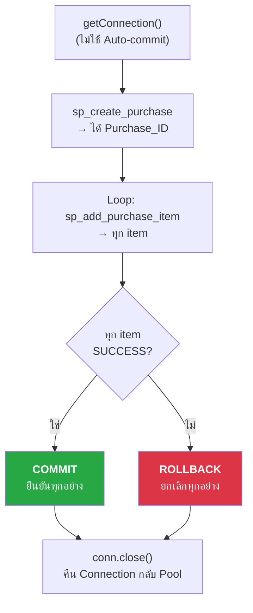

```js
conn = await db.getConnection();     // ← ได้ raw connection (ไม่ auto-commit)
try {
    // ... execute procedures ...
    await conn.commit();             // ✅ สำเร็จ → COMMIT
} catch (err) {
    await conn.rollback();           // ❌ ล้มเหลว → ROLLBACK ทุกอย่าง
} finally {
    await conn.close();              // คืน Connection กลับ Pool เสมอ
}
```

**ACID Properties ที่ใช้:**

| Property | ในระบบนี้ |
|----------|----------|
| **Atomicity** | สร้าง Header + เพิ่ม Items → ต้องสำเร็จทั้งหมด หรือยกเลิกทั้งหมด |
| **Consistency** | FK Constraints ยืนยันว่า Product_ID, Supplier_ID มีจริง |
| **Isolation** | `FOR UPDATE` ป้องกัน Dirty Read / Lost Update |
| **Durability** | หลัง COMMIT → ข้อมูลถูกเขียนลง Disk แน่นอน |

---

## 8. Connection Pool Pattern (`db.js`)

[db.js](file:///d:/dash/DBMSFinal/web/db.js)

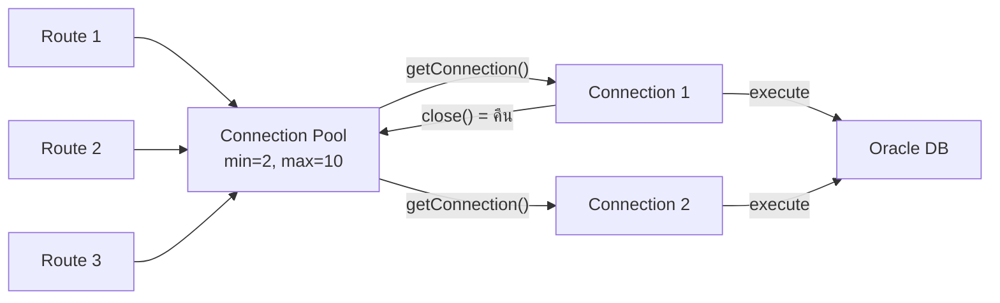

| ฟังก์ชัน | DBMS Concept |
|---------|-------------|
| `execute(sql, binds)` | **Bind Variables** — ป้องกัน SQL Injection, ใช้ `:variable` แทนการ concat string |
| `getConnection()` | **Manual Transaction Control** — ผู้เรียกต้อง commit/rollback เอง |
| `pool.close(0)` | **Graceful Shutdown** — รอ Transaction ที่ค้างอยู่จบก่อน |

---

## 9. SQL Queries ใน Route Files

### JOIN Patterns ที่ใช้บ่อย (ใน `purchases.js`)

```sql
-- ดึงข้อมูลใบสั่งซื้อ + ชื่อ Supplier + ชื่อพนักงาน
SELECT ph.*, s.Supplier_Name,
       e.First_Name || ' ' || e.Last_Name AS Emp_Name
FROM Purchase_Header ph
LEFT JOIN Supplier s ON ph.Supplier_ID = s.Supplier_ID
LEFT JOIN Employees e ON ph.EMP_ID = e.EMP_ID
ORDER BY ph.Purchase_Date DESC;
```

| SQL Concept | อธิบาย |
|------------|--------|
| **LEFT JOIN** | เอาข้อมูล Header มาทั้งหมด ถึงไม่มี Supplier ก็ยังแสดง |
| **`\|\|`** (Concatenation) | ต่อ string เช่น `First_Name || ' ' || Last_Name` |
| **TRIM()** | ลบช่องว่าง padded จาก `CHAR(13)` type |
| **TO_CHAR(date, format)** | แปลง DATE เป็น string ตามรูปแบบ |
| **Bind Variables** (`:id`) | ใส่ค่าผ่าน parameter แทน concat (ป้องกัน SQL Injection) |

---

## 10. สรุป DBMS Concepts ทั้งหมดในโปรเจค

| หมวด | Concept | ไฟล์ที่ใช้ |
|------|---------|----------|
| **DDL** | CREATE TABLE, PRIMARY KEY, FOREIGN KEY, CHAR vs VARCHAR2 | `Table/*.sql` |
| **DML** | INSERT, UPDATE, DELETE, SELECT | ทุก Stored Procedure |
| **Stored Procedure** | IN/OUT Parameters, PL/SQL, Exception Handling | `sp_*.sql` |
| **Trigger** | AFTER trigger, FOR EACH ROW, Compound Trigger, `:OLD`/`:NEW` | `trg_*.sql` |
| **View** | CREATE VIEW, Multi-table JOIN, GROUP BY, CASE | `views.sql` |
| **Sequence** | Auto-increment ID, NEXTVAL, NOCACHE | `sequences.sql` |
| **Cursor** | Implicit FOR LOOP Cursor, SYS_REFCURSOR | `sp_receive_purchase`, `sp_get_dashboard` |
| **Locking** | SELECT FOR UPDATE (Pessimistic Locking) | `sp_add_sale_item`, `sp_receive_purchase` |
| **Transaction** | COMMIT, ROLLBACK, Atomicity | `purchases.js`, `sales.js` |
| **Integrity** | FK Constraints, Manual RI Check before DELETE | `sp_delete_product`, `sp_delete_employee` |
| **Functions** | TO_CHAR, TRUNC, ADD_MONTHS, NVL, SYSDATE, SUBSTR, LPAD | ทุก Procedure |
| **Identity** | GENERATED ALWAYS AS IDENTITY | `Product_Audit_Log`, `Stock_Alert_Log` |
| **Concurrency** | Row-level Lock, Mutating Table Solution | `sp_add_sale_item`, `trg_low_stock_alert` |
| **Connection Pool** | Pool management, Bind Variables | `db.js` |

---

## 11. หลักการ SELECT — กายวิภาคของคำสั่งดึงข้อมูล

SQL ทำงานเป็น **Pipeline** — แต่ละ Clause ที่เขียน Oracle ประมวลผลตามลำดับนี้ (ไม่ใช่ลำดับที่เราเขียน):

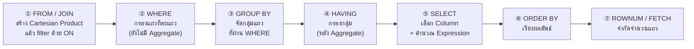

> [!IMPORTANT]
> **ทำไมต้องรู้ลำดับนี้?** เพราะมันกำหนดว่า Alias ที่ตั้งใน `SELECT` ใช้ใน `WHERE` ไม่ได้ (WHERE ทำก่อน SELECT) แต่ใช้ใน `ORDER BY` ได้ (ORDER BY ทำหลัง)

### ตัวอย่างในโปรเจคนี้ — `reports.js` (/api/reports/stock-summary)

```sql
-- ① FROM: ดึง Product ทุกแถว
-- JOIN: ผนวก Category และ Product_Batches เข้า (LEFT JOIN → เอาทั้งหมดแม้ไม่มี Batch)
FROM Product p
LEFT JOIN Category c ON p.Category_ID = c.Category_ID
LEFT JOIN Product_Batches pb ON p.Product_ID = pb.Product_ID

-- ③ GROUP BY: จัดกลุ่มตาม Product แต่ละตัว
GROUP BY p.Product_ID, p.Product_Name, p.Generic_Name,
         c.Category_Name, p.Unit_Price, p.Reorder_Point

-- ⑤ SELECT: คำนวณ Aggregate ในแต่ละกลุ่ม
SELECT p.Product_ID, p.Product_Name,
       NVL(SUM(pb.Remaining_Qty), 0) AS TOTAL_STOCK,  -- ④ aggregate
       COUNT(pb.Batch_ID) AS BATCH_COUNT,
       CASE 
           WHEN NVL(SUM(pb.Remaining_Qty), 0) = 0          THEN 'OUT'
           WHEN NVL(SUM(pb.Remaining_Qty), 0) < p.Reorder_Point THEN 'LOW'
           ELSE 'OK'
       END AS STOCK_STATUS

-- ⑥ ORDER BY: เรียงจากน้อยไปมาก
ORDER BY TOTAL_STOCK ASC
```

---

## 12. JOIN ทุกประเภท — หลักการและผลลัพธ์

### Venn Diagram ของ JOIN

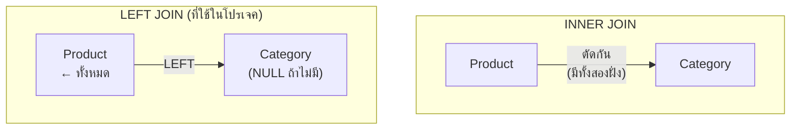

| JOIN Type | SQL | ผลลัพธ์ | ใช้ใน |
|-----------|-----|---------|-------|
| **INNER JOIN** | `JOIN A ON A.id = B.id` | เฉพาะแถวที่มีคู่ทั้ง 2 ฝั่ง | `v_top_products`: Sales → Batch → Product (ต้องมีครบ) |
| **LEFT JOIN** | `LEFT JOIN A ON ...` | ทุกแถวซ้าย, ขวา = NULL ถ้าไม่มีคู่ | `products.js`: Product + Batches (แม้ยังไม่มี Batch ก็แสดง) |
| **SELF JOIN** | `FROM A t1 JOIN A t2` | Join ตารางตัวเอง | ไม่ใช้ในโปรเจค แต่ใช้กับ Employee-Manager |
| **CROSS JOIN** | `FROM A, B` | ทุก combination (Cartesian) | อันตราย! ไม่ใช้จงใจ |

### ทำไม `v_top_products` ใช้ INNER JOIN แทน LEFT JOIN?

```sql
-- ถ้าใช้ LEFT JOIN → จะได้ Product ที่ไม่เคยขายด้วย (TOTAL_SOLD = NULL)
-- ไม่ต้องการ เพราะ "สินค้าขายดี" ต้องขายได้แล้ว
FROM Sales_Detail sd
JOIN Product_Batches pb ON sd.Batch_ID = pb.Batch_ID   -- INNER
JOIN Product p          ON pb.Product_ID = p.Product_ID -- INNER
```

### การ JOIN ข้ามหลายตาราง (Chain Join)

```sql
-- Sales_Detail → (Batch_ID) → Product_Batches → (Product_ID) → Product
-- ต้องผ่าน Product_Batches ก่อน ไม่สามารถ JOIN Sales_Detail → Product โดยตรง
-- เพราะไม่มี FK โดยตรง (นี่คือสาเหตุที่ออกแบบผ่าน Batch)
```

---

## 13. Subquery — Query ซ้อน Query

โปรเจคนี้ใช้ Subquery หลัก 3 รูปแบบ:

### 13.1 Scalar Subquery (ใน SELECT — ได้ค่าเดียว)

```sql
-- ใน products.js: ดึงสต็อกรวมของแต่ละสินค้า
SELECT p.Product_ID, p.Product_Name,
       NVL(
           (SELECT SUM(b.Remaining_Qty) 
            FROM Product_Batches b 
            WHERE b.Product_ID = p.Product_ID)
       , 0) AS Total_Stock
FROM Product p
```

**หลักการ**: Oracle รัน Subquery นี้ **ทุกแถว** ของ `Product` (Correlated) → ได้ค่าเดียวต่อแถว
- ข้อดี: เข้าใจง่าย อ่านชัด
- ข้อเสีย: ถ้ามี 1,000 Product → รัน Subquery 1,000 ครั้ง (Slow กว่า JOIN)
- โปรเจคนี้ยอมรับได้ เพราะสินค้าในร้านยาไม่ถึงหลักหมื่น

### 13.2 Inline View Subquery (ใน FROM — ได้ตารางชั่วคราว)

```sql
-- ใน reports.js: ROWNUM ต้องอยู่นอก ORDER BY จึงต้องห่อด้วย Inline View
SELECT * FROM (
    SELECT p.Product_Name,
           SUM(sd.Quantity) AS TOTAL_SOLD,
           SUM(sd.Subtotal) AS TOTAL_REVENUE
    FROM Sales_Detail sd
    JOIN Product_Batches pb ON sd.Batch_ID = pb.Batch_ID
    JOIN Product p ON pb.Product_ID = p.Product_ID
    GROUP BY p.Product_Name
    ORDER BY TOTAL_SOLD DESC   -- ① เรียงก่อน
) WHERE ROWNUM <= 10           -- ② แล้วค่อยตัด 10 อันแรก
```

> [!CAUTION]
> **ทำไมต้อง Wrap ด้วย Inline View ก่อน?**
> ถ้าเขียน `WHERE ROWNUM <= 10` โดยตรงพร้อม `ORDER BY` → Oracle อาจตัด 10 แถวแรกก่อนที่จะเรียง → ได้ผลลัพธ์ผิด!
> ต้องให้ Inner Query เรียงก่อน แล้ว Outer Query ค่อยตัด

### 13.3 Correlated Subquery (อ้างอิง Outer Query)

```sql
-- ใน sp_get_dashboard: หา Batch ที่ใกล้หมดอายุ
OPEN p_expiring_cur FOR
    SELECT pb.Batch_ID, p.Product_Name, pb.EXP_date,
           ROUND(pb.EXP_date - SYSDATE) AS Days_Left
    FROM Product_Batches pb
    JOIN Product p ON pb.Product_ID = p.Product_ID
    WHERE pb.EXP_date <= SYSDATE + 90   -- อีก 90 วันจะหมด
      AND pb.Remaining_Qty > 0           -- ยังมีอยู่
    ORDER BY pb.EXP_date;
```

---

## 14. Cursor — กลไกการดึงข้อมูลแบบทีละแถว

Oracle ไม่ได้ส่ง Query ผลลัพธ์ทั้งหมดกลับมาพร้อมกัน แต่ใช้ **Cursor** เป็น "เข็มชี้" ในชุดผลลัพธ์

### Cursor 3 ประเภทในโปรเจคนี้

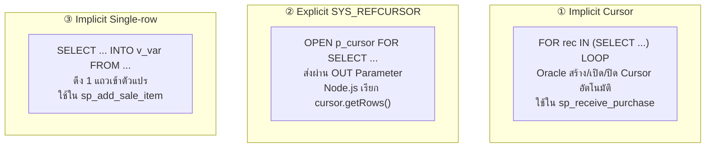

### ① Implicit Cursor FOR LOOP (ใน `sp_receive_purchase`)

```sql
-- Oracle จัดการทุกอย่างอัตโนมัติ: เปิด Cursor, Fetch, ปิด
FOR rec IN (
    SELECT pd.Product_ID, pd.Order_Qty, pd.Cost_Price
    FROM Purchase_Detail pd
    WHERE TRIM(pd.Purchase_ID) = TRIM(p_purchase_id)
) LOOP
    -- rec.Product_ID, rec.Order_Qty พร้อมใช้งานทันที
    v_batch_count := v_batch_count + 1;
    v_batch_id := 'B' || TO_CHAR(SYSDATE, 'YYMMDDHH24MI') || LPAD(v_batch_count, 2, '0');
    
    INSERT INTO Product_Batches (Batch_ID, Product_ID, ...) 
    VALUES (v_batch_id, rec.Product_ID, ...);
END LOOP;
```

**ทำไม** `FOR rec IN (SELECT ...) LOOP` ดีกว่า Explicit Cursor?
- ไม่ต้อง DECLARE, OPEN, FETCH, CLOSE
- Oracle ป้องกันหลุดลืมปิด Cursor ให้อัตโนมัติ
- Code สั้นกว่า อ่านง่ายกว่า

### ② SYS_REFCURSOR (ใน `sp_get_dashboard`)

```sql
-- ฝั่ง PL/SQL: เปิด Cursor แล้วผูกกับ Query
OPEN p_low_stock_cur FOR
    SELECT p.Product_ID, p.Product_Name,
           NVL(SUM(pb.Remaining_Qty), 0) AS Total_Stock,
           p.Reorder_Point
    FROM Product p
    LEFT JOIN Product_Batches pb ON p.Product_ID = pb.Product_ID
    GROUP BY p.Product_ID, p.Product_Name, p.Reorder_Point
    HAVING NVL(SUM(pb.Remaining_Qty), 0) < p.Reorder_Point;
```

```js
// ฝั่ง Node.js (dashboard.js): รับ Cursor มาแล้ว getRows()
const binds = result.outBinds;
const lowStockRows = await binds.p_low_stock_cur.getRows(100); // ดึงสูงสุด 100 แถว
await binds.p_low_stock_cur.close(); // ต้องปิดเอง!
```

> [!IMPORTANT]
> **ทำไมต้อง `cursor.close()` ด้วยตัวเอง?**
> SYS_REFCURSOR ที่ส่งออกมาจาก PL/SQL → Oracle จะ Hold Connection Resource ค้างไว้ จนกว่า Node.js จะ `close()` ถ้าไม่ปิด → Resource Leak → Connection Pool หมดในที่สุด

### ③ SELECT INTO (Implicit Single-Row Fetch)

```sql
-- ใน sp_add_sale_item: ดึงสต็อกมาเช็คก่อนขาย
SELECT Remaining_Qty
INTO v_remaining              -- ← เก็บค่าเข้าตัวแปร
FROM Product_Batches
WHERE TRIM(Batch_ID) = TRIM(p_batch_id)
FOR UPDATE;                    -- ← ล็อกแถวด้วย

-- Exception อัตโนมัติ:
-- ถ้าไม่มีแถว → WHEN NO_DATA_FOUND
-- ถ้ามีมากกว่า 1 แถว → WHEN TOO_MANY_ROWS
```

---

## 15. Bind Variables — หัวใจความปลอดภัยและประสิทธิภาพ

### หลักการ: Soft Parse vs Hard Parse

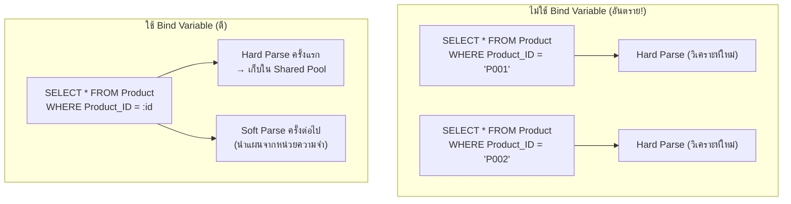

### ตัวอย่างใน `db.js`

```js
// db.execute() รับ binds เป็น Object เสมอ
await db.execute(
    `SELECT p.*, c.Category_Name 
     FROM Product p 
     LEFT JOIN Category c ON p.Category_ID = c.Category_ID 
     WHERE TRIM(p.Product_ID) = :id`,   // ← :id คือ Bind Variable
    { id: req.params.id.trim() }         // ← ค่าจริงส่งแยก ไม่ได้ concat
);
```

### ป้องกัน SQL Injection อย่างไร?

```
❌ ถ้า concat: "WHERE id = '" + userInput + "'"
   userInput = "X' OR '1'='1"
   → "WHERE id = 'X' OR '1'='1'"  → ดึงข้อมูลทั้งหมด!

✅ ถ้า Bind: "WHERE id = :id" + binds = {id: "X' OR '1'='1"}
   Oracle ถือว่า binds เป็นข้อมูล ไม่ใช่ SQL
   → Safe ทันที
```

### BIND_IN / BIND_OUT / BIND_INOUT

```js
{
    // BIND_IN: ส่งค่าเข้าไปอย่างเดียว (default)
    p_emp_id: EMP_ID,

    // BIND_OUT: รอรับค่าออกมาจาก Procedure
    p_sale_id: { dir: oracledb.BIND_OUT, type: oracledb.STRING, maxSize: 20 },

    // BIND_INOUT: ส่งค่าเข้า และอาจรับค่าที่ถูกแก้ไขกลับมา
    p_id: { val: Product_ID || null, dir: oracledb.BIND_INOUT, type: oracledb.STRING, maxSize: 20 },
}
```

---

## 16. PL/SQL Control Flow — การควบคุมกระแสใน Stored Procedure

### 16.1 IF / ELSIF / ELSE (ใน `sp_upsert_product`)

```sql
-- เช็ค action ก่อนเลือกทำ INSERT หรือ UPDATE
IF UPPER(p_action) = 'INSERT' THEN
    -- UPPER() → กัน case sensitivity ('insert'/'INSERT'/'Insert' → เหมือนกัน)
    INSERT INTO Product (Product_ID, Drug_type, Product_Name, ...)
    VALUES (p_product_id, p_drug_type, p_product_name, ...);
    p_result := 'SUCCESS: เพิ่มสินค้าสำเร็จ ID=' || p_product_id;

ELSIF UPPER(p_action) = 'UPDATE' THEN
    UPDATE Product
    SET Drug_type = p_drug_type,
        Product_Name = p_product_name,
        Unit_Price = p_unit_price
    WHERE TRIM(Product_ID) = TRIM(p_product_id);  -- TRIM กัน CHAR padding
    
    IF SQL%ROWCOUNT = 0 THEN   -- ← SQL%ROWCOUNT = จำนวนแถวที่ถูกกระทบ
        p_result := 'ERROR: ไม่พบสินค้า ID=' || p_product_id;
        RETURN;
    END IF;
    p_result := 'SUCCESS: แก้ไขสำเร็จ';

ELSE
    p_result := 'ERROR: action ไม่ถูกต้อง';
END IF;
```

### 16.2 FOR LOOP (ใน `sp_receive_purchase`)

```sql
v_batch_count := 0;   -- ← ตัวนับสำหรับสร้าง Unique Batch_ID

FOR rec IN (SELECT pd.Product_ID, pd.Order_Qty, pd.Cost_Price
            FROM Purchase_Detail pd
            WHERE TRIM(pd.Purchase_ID) = TRIM(p_purchase_id))
LOOP
    v_batch_count := v_batch_count + 1;
    
    -- สร้าง Batch_ID แบบ 'B' + Timestamp + Running Number
    v_batch_id := 'B' || TO_CHAR(SYSDATE, 'YYMMDDHH24MI') || LPAD(v_batch_count, 2, '0');
    v_batch_id := SUBSTR(v_batch_id, 1, 13);  -- ตัดให้พอดี CHAR(13)
    
    INSERT INTO Product_Batches (
        Batch_ID, MFG_date, EXP_date, Cost_Price,
        Lot_Number, Received_Qty, Remaining_Qty,
        Import_Date, Product_ID, Purchase_ID
    ) VALUES (
        v_batch_id,
        SYSDATE,                      -- วันผลิต = วันรับ (simplification)
        ADD_MONTHS(SYSDATE, 24),      -- หมดอายุ 2 ปี
        rec.Cost_Price,               -- ← ค่าจาก Cursor
        'LOT-' || v_batch_id,
        rec.Order_Qty,                -- จำนวนที่สั่ง = จำนวนที่รับ
        rec.Order_Qty,                -- Remaining = Received เริ่มต้น
        SYSDATE, rec.Product_ID, p_purchase_id
    );
END LOOP;

p_result := 'SUCCESS: สร้าง ' || v_batch_count || ' Batch สำเร็จ';
```

### 16.3 WHILE LOOP vs FOR LOOP

| | `FOR rec IN (SELECT ...) LOOP` | `WHILE condition LOOP` |
|--|--|--|
| เหมาะกับ | วนทุกแถวจาก Query | วนตามเงื่อนไขที่ไม่รู้จำนวนรอบ |
| Cursor | Oracle จัดการอัตโนมัติ | ต้อง OPEN/FETCH/CLOSE เอง |
| ใช้ใน | `sp_receive_purchase` | ไม่ค่อยใช้ (มักใช้ FOR แทน) |

---

## 17. Exception Handling — ดักจับข้อผิดพลาด

### ลำดับการทำงาน

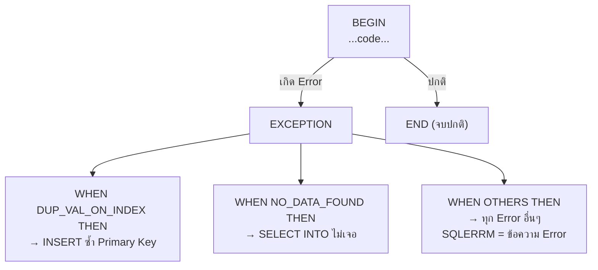

### ตัวอย่างจริงใน Stored Procedures

```sql
-- sp_create_purchase: ดักจับ Duplicate Purchase_ID (กรณีสร้างพร้อมกันในวินาทีเดียว)
EXCEPTION
    WHEN DUP_VAL_ON_INDEX THEN
        p_result := 'ERROR: Purchase ID ซ้ำ กรุณาลองอีกครั้ง';
    WHEN OTHERS THEN
        p_result := 'ERROR: ' || SQLERRM;  -- SQLERRM = Oracle Error Message
        ROLLBACK;
```

```sql
-- sp_add_sale_item: ดักจับ Batch ไม่มีในระบบ
EXCEPTION
    WHEN NO_DATA_FOUND THEN
        p_result := 'ERROR: ไม่พบ Batch_ID ' || p_batch_id;
    WHEN OTHERS THEN
        p_result := 'ERROR: ' || SQLERRM;
```

### Named Exception vs Unnamed Exception

| Exception | ORA Code | เกิดเมื่อ |
|-----------|---------|---------|
| `DUP_VAL_ON_INDEX` | ORA-00001 | INSERT ซ้ำ PK/Unique |
| `NO_DATA_FOUND` | ORA-01403 | SELECT INTO ไม่เจอแถว |
| `TOO_MANY_ROWS` | ORA-01422 | SELECT INTO เจอมากกว่า 1 |
| `VALUE_ERROR` | ORA-06502 | String buffer เล็กเกิน |
| `WHEN OTHERS` | ทุก ORA | Catch-all |

> [!TIP]
> **`SQLERRM`** คือตัวแปร built-in ที่เก็บข้อความ Error ล่าสุด ใช้ใน `WHEN OTHERS` เพื่อส่ง Error Message กลับไปยัง Application Layer ผ่าน `p_result` OUT Parameter

---

## 18. Oracle Data Types — ทำไมเลือก Type นี้

| Column | Type | เหตุผล |
|--------|------|--------|
| `Product_ID` | `CHAR(13)` | ความยาวคงที่ Oracle pad ด้วย space → ต้องใช้ `TRIM()` เสมอ |
| `Product_Name` | `VARCHAR2(100)` | ความยาวแปรผัน ประหยัด Storage |
| `EMP_ID` | `CHAR(10)` | รหัสพนักงานมีรูปแบบตายตัว เช่น `E000000001` |
| `Purchase_Date` | `DATE` | เก็บทั้ง วัน+เวลา ใน Oracle (ต่างจาก MySQL ที่ DATE ไม่มีเวลา) |
| `Changed_At` | `TIMESTAMP` | มี precision เป็น fractional seconds — ใช้ใน Audit Log |
| `Total_Amount` | `NUMBER` | ทศนิยม unlimited precision (ต่างจาก FLOAT ที่มี rounding error) |
| `Log_ID` | `NUMBER GENERATED ALWAYS AS IDENTITY` | Auto-increment แบบ Oracle 12c+ (ไม่ต้องใช้ Sequence + Trigger) |
| `Password_Hash` | `VARCHAR2(100)` | เก็บ Hash ของ Password ไม่เก็บ Plain Text |

### CHAR vs VARCHAR2 — ปัญหา Padding

```sql
-- ตาราง Employees มี EMP_ID CHAR(10)
-- เก็บ 'E001' จริงๆ จะได้ 'E001      ' (มี space 6 ตัว)

-- ❌ ผิด: เปรียบเทียบตรงๆ
WHERE EMP_ID = 'E001'   -- อาจไม่เจอ ถ้า Oracle ไม่ trim ให้

-- ✅ ถูก: ใช้ TRIM()
WHERE TRIM(EMP_ID) = 'E001'

-- หรือใน Node.js: req.params.id.trim() ก่อนส่ง Bind
```

---

## 19. Aggregate Functions — สรุปข้อมูลกลุ่ม

### ฟังก์ชันที่ใช้ในโปรเจคนี้

| Function | ตัวอย่างในโปรเจค | ผลลัพธ์ |
|----------|-----------------|---------|
| `SUM(expr)` | `SUM(pb.Remaining_Qty)` | รวมสต็อกทุก Batch ของสินค้า |
| `COUNT(*)` | `COUNT(*)` ใน `v_monthly_sales` | นับจำนวนบิลขาย |
| `COUNT(col)` | `COUNT(pb.Batch_ID)` | นับ Batch ที่ไม่ใช่ NULL |
| `NVL(SUM(...), 0)` | สินค้าที่ยังไม่มี Batch | กัน NULL → แสดงเป็น 0 |
| `MIN(pb.EXP_date)` | หา EXP ที่ใกล้หมดสุด | วันหมดอายุล็อตแรกสุด |
| `ROUND(expr)` | `ROUND(pb.EXP_date - SYSDATE)` | ปัดเศษวันที่เหลือ |

### GROUP BY + HAVING (ความต่างสำคัญ)

```sql
-- WHERE กรองแถว (ก่อน GROUP)
-- HAVING กรองกลุ่ม (หลัง GROUP และ Aggregate)

-- ตัวอย่าง: หา Product ที่สต็อกรวมต่ำกว่า Reorder Point
SELECT p.Product_ID, NVL(SUM(pb.Remaining_Qty), 0) AS Total
FROM Product p
LEFT JOIN Product_Batches pb ON p.Product_ID = pb.Product_ID
GROUP BY p.Product_ID, p.Reorder_Point
HAVING NVL(SUM(pb.Remaining_Qty), 0) < p.Reorder_Point
--     ^^^ ใช้ HAVING ไม่ใช่ WHERE เพราะ SUM() ต้องรู้ทั้งกลุ่มก่อน
```

---

## 20. Data Flow ครบวงจร — จาก Click ถึง Database และกลับมา

### กรณีศึกษา: กดปุ่ม "ชำระเงิน" ในหน้า POS

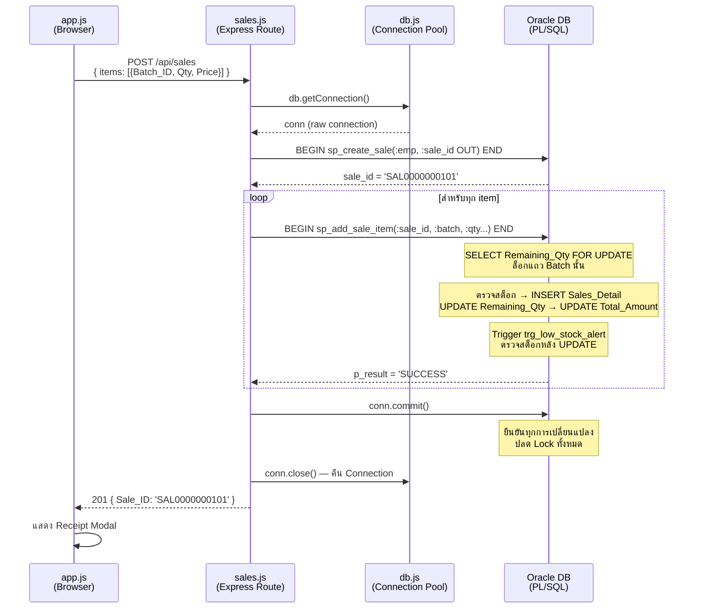

### จุดที่ DBMS Concepts ทำงานพร้อมกัน

```
ขณะที่ sp_add_sale_item ทำงาน:
│
├── Atomicity      → INSERT + 2×UPDATE รวมเป็น 1 Transaction unit
├── FOR UPDATE     → Row-level Lock บน Product_Batches แถวนั้น
├── Bind Variable  → ค่า p_batch_id, p_quantity ไม่ถูก parse เป็น SQL
├── NVL()          → กัน NULL ใน Discount field
├── Exception      → WHEN NO_DATA_FOUND ถ้า Batch ไม่มี
│
└── trg_low_stock_alert ถูก Auto-fire หลัง UPDATE Remaining_Qty:
    ├── AFTER EACH ROW → เก็บ Product_ID ใน PL/SQL Collection
    └── AFTER STATEMENT → SELECT SUM() เทียบ Reorder_Point
                          → INSERT Stock_Alert_Log ถ้าต่ำเกิน
```

---

## 21. Oracle-Specific Functions — อธิบายทุกฟังก์ชันที่ใช้

| Function | Syntax | ตัวอย่างในโปรเจค | ความหมาย |
|----------|--------|-----------------|---------|
| `TO_CHAR(date, fmt)` | `TO_CHAR(SYSDATE, 'YYYY-MM-DD')` | แปลงวันที่เป็น String | ใช้แสดงผลและสร้าง ID |
| `TO_CHAR(num, fmt)` | `TO_CHAR(num, 'FM0000000000')` | แปลงตัวเลขเป็น String | Pad ด้วย 0 |
| `TRUNC(date)` | `TRUNC(SYSDATE)` | ตัดเวลาออก → เหลือแค่วัน | เปรียบเทียบวันที่ exact |
| `ADD_MONTHS(date, n)` | `ADD_MONTHS(SYSDATE, 24)` | บวกเดือน (2 ปี) | คำนวณวันหมดอายุ Batch |
| `SYSDATE` | `SYSDATE` | วันเวลา Server ปัจจุบัน | Import_Date, Sale_date |
| `SYSTIMESTAMP` | `SYSTIMESTAMP` | เหมือน SYSDATE + มี ms | สร้าง Unique Timestamp ID |
| `NVL(expr, default)` | `NVL(SUM(...), 0)` | แทน NULL ด้วยค่า default | กัน NULL ใน aggregate |
| `NVL2(expr, t, f)` | — | ถ้าไม่ NULL → t, NULL → f | ไม่ใช้ในโปรเจคนี้ตรงๆ |
| `LPAD(str, n, pad)` | `LPAD(100, 10, '0')` → `0000000100` | เติม padding ซ้าย | สร้าง formatted ID |
| `SUBSTR(str, pos, len)` | `SUBSTR(v_id, 1, 13)` | ตัด Substring | ตัด ID ให้พอดี CHAR(13) |
| `TRIM(str)` | `TRIM(Product_ID)` | ลบ space หัว-ท้าย | แก้ CHAR padding |
| `UPPER(str)` | `UPPER(p_action)` | ทำให้เป็น uppercase | กัน case mismatch |
| `ROUND(expr)` | `ROUND(EXP_date - SYSDATE)` | ปัดเศษ | นับวันเหลือ |
| `ROWNUM` | `WHERE ROWNUM <= 10` | หมายเลขแถวผลลัพธ์ | จำกัดจำนวนแถว (แบบ LIMIT) |

### `ROWNUM` vs `FETCH FIRST` (Oracle 12c+)

```sql
-- แบบเก่า (Oracle 11g ลงมา) — ต้อง Wrap Subquery
SELECT * FROM (
    SELECT ... ORDER BY col DESC
) WHERE ROWNUM <= 10;

-- แบบใหม่ (Oracle 12c ขึ้นไป) — เขียนตรงๆ ได้
SELECT ... FROM ...
ORDER BY col DESC
FETCH FIRST 10 ROWS ONLY;   -- หรือ FETCH FIRST 10 ROWS WITH TIES
```

โปรเจคนี้ใช้แบบเก่า (Inline View + ROWNUM) เพื่อ compatibility กับ Oracle ทุกเวอร์ชัน

---

## 22. สรุปหลักการ DBMS เพิ่มเติม (Extended Concepts)

### Normalization — ทำไม Schema ถึงออกแบบแบบนี้

| Normal Form | กฎ | ในโปรเจคนี้ |
|------------|-----|------------|
| **1NF** | แต่ละ Cell มีค่าเดียว | ✅ ทุก Column atomic (ไม่มี Array ใน Column) |
| **2NF** | ไม่มี Partial Dependency | ✅ ทุก Column ขึ้นกับ PK ทั้งหมด |
| **3NF** | ไม่มี Transitive Dependency | ✅ `Category_Name` อยู่ใน `Category` table ไม่ใช่ `Product` |

**ตัวอย่าง 3NF**: ถ้าเก็บ `Category_Name` ใน `Product` table โดยตรง → ถ้าชื่อหมวดเปลี่ยน ต้องแก้ทุกแถว Product ทุกตัวในหมวดนั้น → ใช้ FK แทน แค่แก้ที่ Category table เดียว

### Index และ Performance (Implicit ใน Oracle)

Oracle สร้าง **Index อัตโนมัติ** บน Primary Key และ Unique Constraint ทุกตัว:

```sql
-- สร้าง PK → Oracle สร้าง Unique Index ให้อัตโนมัติ
CONSTRAINT Product_PK PRIMARY KEY (Product_ID)
-- → Oracle Index บน Product_ID column

-- ทุก WHERE ที่เปรียบเทียบ PK/FK จะใช้ Index → Fast lookup O(log n)
WHERE TRIM(Product_ID) = :id
-- ⚠️ แต่ TRIM() ทำลาย Index! Oracle ต้อง Full Scan แทน
-- Production จริงควรใช้ Function-based Index หรือ CHAR → VARCHAR2
```

### State Machine — Purchase Status

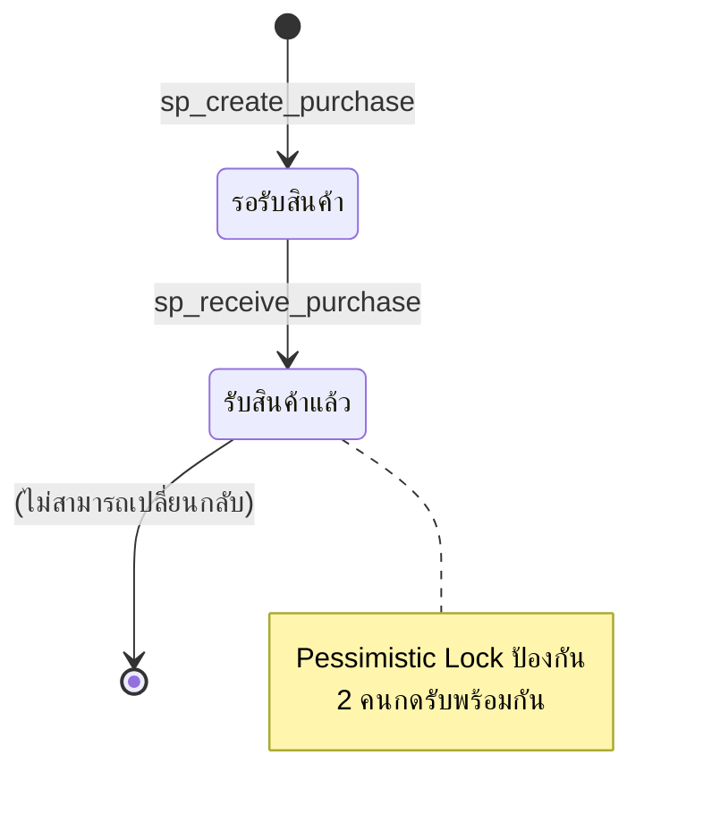

```sql
-- ใน sp_receive_purchase: เช็คสถานะก่อนเสมอ
SELECT Status INTO v_status
FROM Purchase_Header
WHERE TRIM(Purchase_ID) = TRIM(p_purchase_id)
FOR UPDATE;                          -- ล็อกก่อนเช็ค

IF v_status = 'รับสินค้าแล้ว' THEN  -- State Guard
    p_result := 'ERROR: รับสินค้าไปแล้ว';
    RETURN;
END IF;
```

---

## 23. Connection Pool — ทรัพยากรที่ใช้ร่วมกัน

```js
// db.js: สร้าง Pool ครั้งเดียวตอน Startup
const pool = await oracledb.createPool({
    user: process.env.DB_USER,
    password: process.env.DB_PASSWORD,
    connectString: process.env.DB_HOST,
    poolMin: 2,              // เปิด Connection ค้างไว้ขั้นต่ำ 2
    poolMax: 10,             // สูงสุด 10 Connection พร้อมกัน
    poolIncrement: 1         // เพิ่มทีละ 1 เมื่อต้องการมากขึ้น
});
```

### ทำไมใช้ Pool แทนการเปิด Connection ใหม่ทุกครั้ง?

| | เปิด Connection ใหม่ทุก Request | Connection Pool |
|--|--|--|
| เวลา | ~100-500ms ต่อ Request | ~1ms (หยิบจาก Pool) |
| Memory | เปิด-ปิดบ่อย overhead สูง | ค้างไว้ใช้ซ้ำ |
| Oracle License | Connection = DB Process = Cost | จำกัด Max Connection |
| Scalability | 100 Request → 100 Connections | 100 Request → Max 10 Connections |

### 2 โหมดการใช้ Connection

```js
// โหมดที่ 1: db.execute() — Auto-commit (สำหรับ Query & Simple DML)
// ภายใน db.js ใช้ pool.execute() ซึ่ง auto-commit หลังทุก statement
const result = await db.execute(`SELECT ...`, { id });

// โหมดที่ 2: db.getConnection() — Manual Transaction (สำหรับ Multi-step)
// ใช้เมื่อต้องการ COMMIT/ROLLBACK ทั้งกลุ่มพร้อมกัน
const conn = await db.getConnection();
try {
    await conn.execute(`BEGIN sp_create_sale(...) END;`, binds);
    await conn.execute(`BEGIN sp_add_sale_item(...) END;`, binds);
    await conn.commit();      // ✅ ทั้ง 2 คำสั่งยืนยันพร้อมกัน
} catch (e) {
    await conn.rollback();    // ❌ ทั้ง 2 คำสั่งยกเลิกพร้อมกัน
} finally {
    await conn.close();       // คืน Connection กลับ Pool เสมอ
}
```

> [!CAUTION]
> **`conn.close()` ใน `finally` สำคัญมาก!** ถ้าไม่คืน Connection กลับ Pool → Pool จะเต็มใน max=10 Request → Request ที่ 11 จะ Timeout → ระบบล่ม

